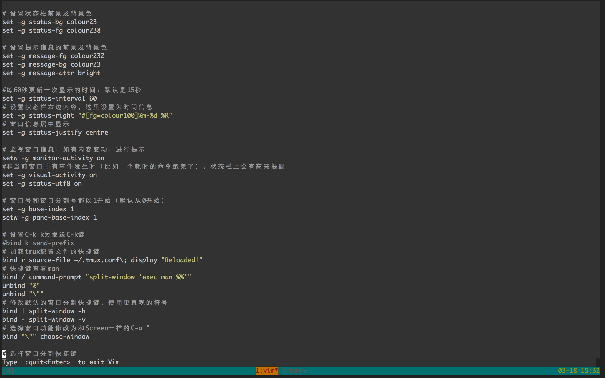

# vim_conf
* 我的 .tmux_conf 文件
* 我比较喜欢的配色

* 支持vi模式

=USE=

* control + b 进入tmux命令模式,control + b  简写为crl

* 快捷键

<pre>
crl -> c 新建tab

crl -> t 切换tab

crl -> 1~9 选择tab

crl -> [ 进入vi模式，此时按照j,k,l,i可以左下右上的进行页面移动

crl -> [ -> v 进入选择模式 -> y复制  

crl -> ] 粘贴
 </pre>
